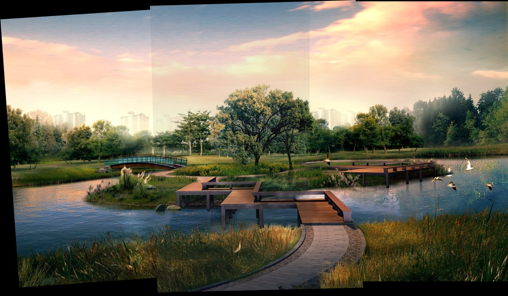
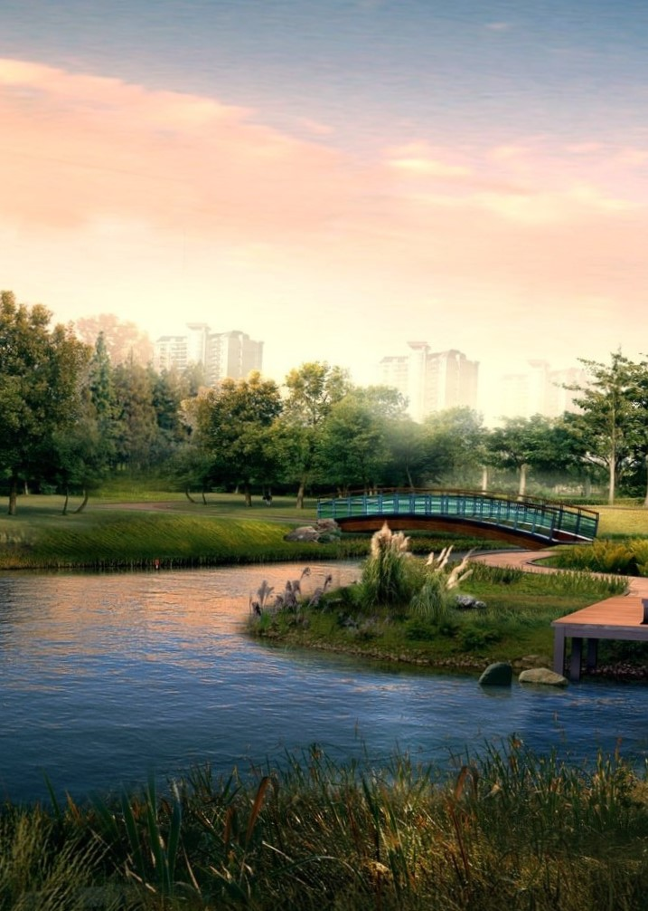
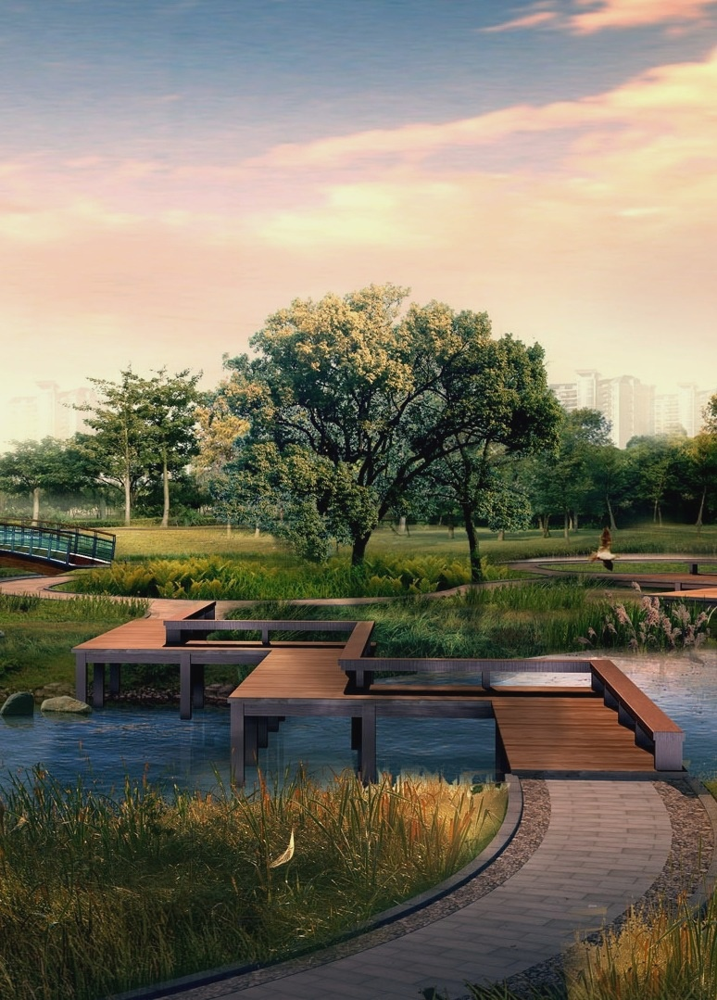
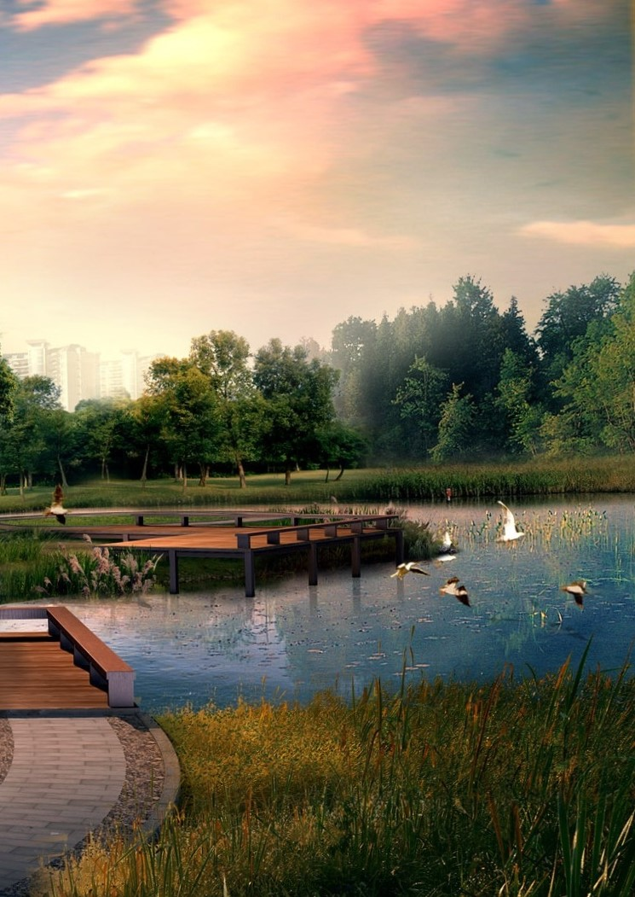
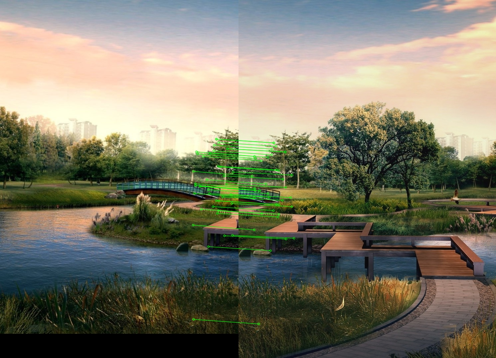
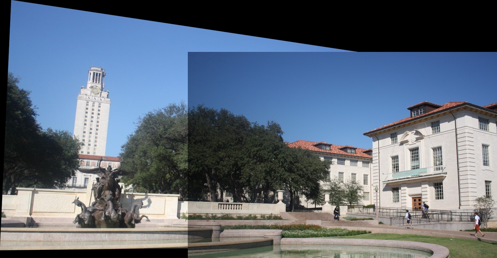
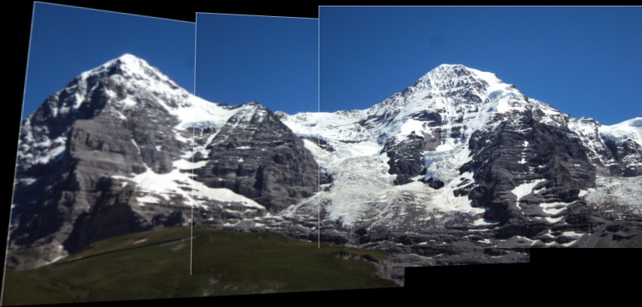
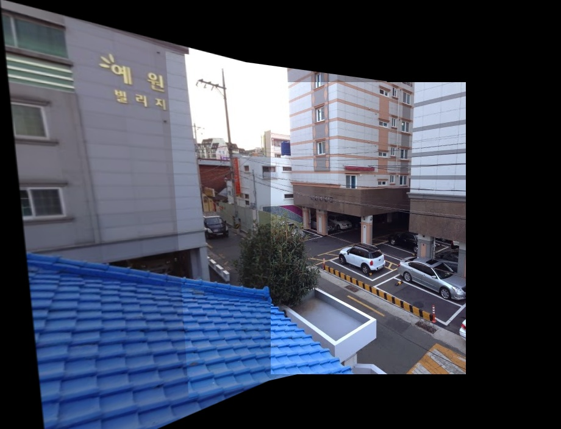
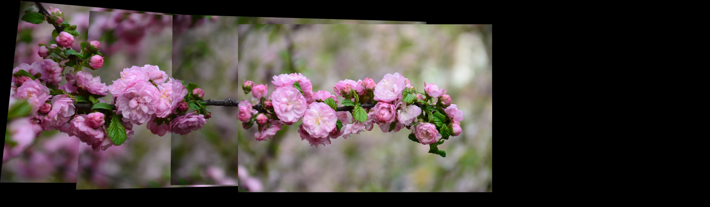

# Multi-Image Panorama Creation

## Why?

Sometimes the scenes what you want to capture are much larger than the camera you have.

What we can do in this case is capture multiple images and stitch them together to form one large image (of the entire scene).

Such photos of ordered scenes of collections are called panoramas. The entire process of acquiring multiple image and converting them into such panoramas is called as image stitching

## How?

Creating such panoramas involves the following steps:

1.  Estimate [homography](https://docs.opencv.org/3.4.1/d9/dab/tutorial_homography.html)
    1. Compute the sift-key points and descriptors (feature extraction)
    2. Select the top best matches for each descriptor of an image.
    3. Match correspondence between descriptors of the images
    4. Use these matched points with [RANSAC](https://www.mathworks.com/discovery/ransac.html) to compute [homography](https://docs.opencv.org/3.4.1/d9/dab/tutorial_homography.html)

2.  Image-Warping
    1. Use the homography calculated to align the images properly

3. Stitch the images
    1. Stitch the aligned images
    1. Do any cleaning if needed (eg. trim)

## The process

### The images
I will be using the following images:

  |   | 
:-------------------------:|:-------------------------:|:-------------------------:

### Finding Keypoints
In order to join any two images into a bigger image, we must find overlapping points. These overlapping points will give us an idea of the orientation of the second image according to first one.

Some features might be existing in multiple places. So we filter out through all the matches to obtain the best ones using [Lowe's] ratio test.

We can use SIFT and BFMatcher from `opencv` for the same which give us the following result:

### Stitching them up!
Once we find the relative orientations, we flip the perspective to match the others.
Then we stitch them all together!

## Other examples / results:
#### Building [[source]](https://towardsdatascience.com/image-stitching-using-opencv-817779c86a83)

#### Hills [[source]](https://github.com/daeyun/Image-Stitching/tree/master/img/hill)

#### Street [[source]](http://study.marearts.com/2013/11/opencv-stitching-example-stitcher-class.html)

#### Flower [[source]](https://github.com/ppwwyyxx/OpenPano/releases/tag/0.1)

